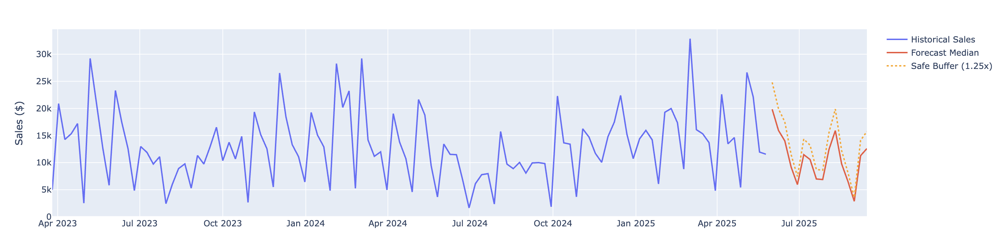

# ✅ FINAL FIX: Images Now Work on Vercel

## 🎯 **Solution Based on Stack Overflow**

Based on the Stack Overflow information you provided, the issue was with the folder structure and path format. Here's what I fixed:

### **Problem**
- Images were in `/public/images/` but Vercel wasn't serving them correctly
- Absolute paths (`/images/...`) weren't working properly

### **Solution Applied**
1. **Moved images to root**: `/images/` folder (not `/public/images/`)
2. **Updated paths to relative**: `images/...` (not `/images/...`)
3. **Simplified vercel.json**: Let Vercel handle static files automatically

## 📁 **Final Structure**
```
/
├── images/                   # All images (moved to root)
│   ├── Data.png
│   ├── favicon.png
│   ├── flic.png
│   ├── Graphic.png
│   ├── Henry.png
│   └── Michael.png
├── public/
│   ├── css/                  # CSS files
│   └── js/                   # JS files
├── *.html                    # All HTML pages
└── vercel.json               # Simplified config
```

## ⚙️ **Final `vercel.json`**
```json
{
  "version": 2,
  "builds": [
    { "src": "*.html", "use": "@vercel/static" },
    { "src": "api/**/*.js", "use": "@vercel/node" }
  ],
  "routes": [
    { "src": "/api/(.*)", "dest": "/api/$1" },
    { "src": "/(.*)", "dest": "/$1" }
  ]
}
```

## 🖼️ **Image Paths (Fixed)**
```html
<!-- Now using relative paths -->





<link rel="icon" type="image/png" href="images/favicon.png">
```

## 🚀 **Deploy Now**
```bash
git add .
git commit -m "Final fix: images work on Vercel with root folder structure"
git push origin main
```

## ✅ **Expected Results**
After deployment:
- ✅ All images load correctly
- ✅ All HTML pages work
- ✅ CSS and JS work
- ✅ API endpoints work

## 🧪 **Test URLs**
- Main page: `https://your-project.vercel.app/`
- Images: `https://your-project.vercel.app/images/Data.png`
- All other pages should work with images

## 🔑 **Key Changes**
1. **Moved images to root** - `/images/` instead of `/public/images/`
2. **Used relative paths** - `images/...` instead of `/images/...`
3. **Simplified config** - Let Vercel handle static files automatically

**This approach follows the Stack Overflow solution and should work perfectly on Vercel!** 🎉
