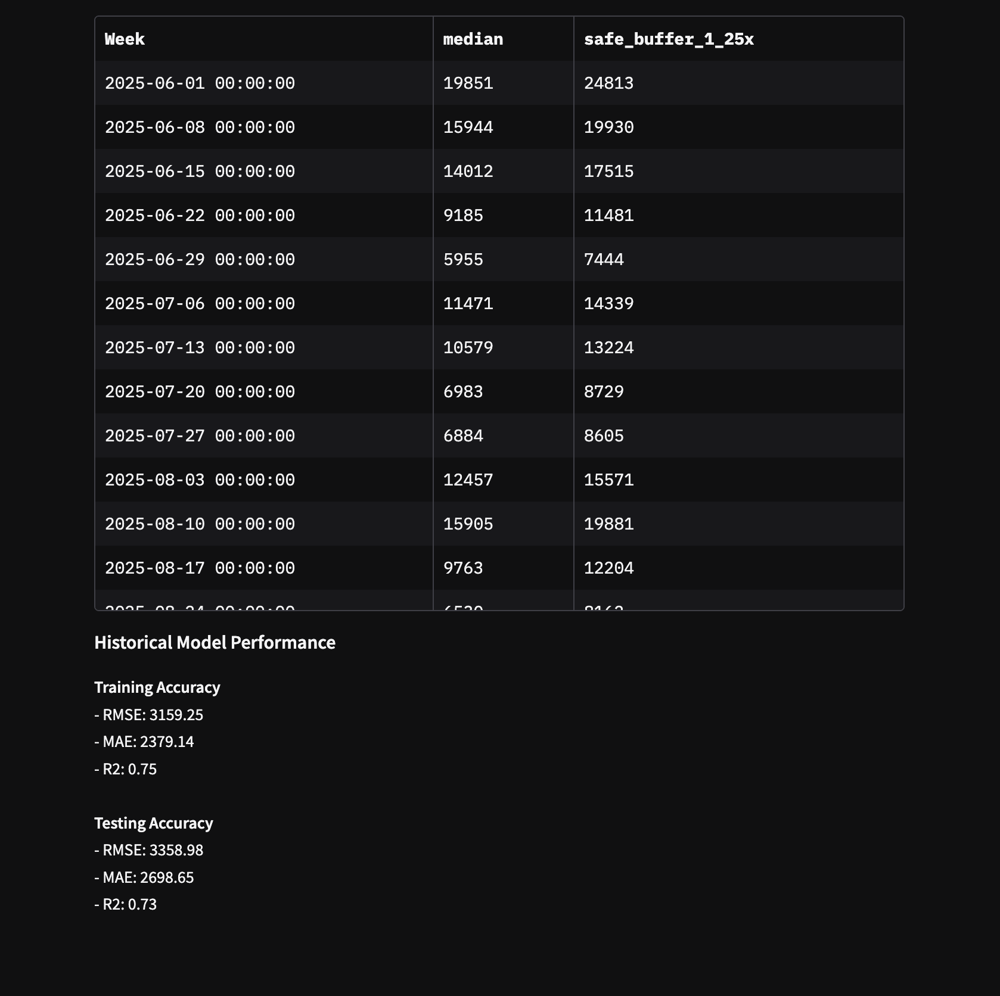

# Test Image Paths

## Current Structure
```
/
├── public/
│   ├── images/
│   │   ├── Data.png
│   │   ├── favicon.png
│   │   ├── flic.png
│   │   ├── Graphic.png
│   │   ├── Henry.png
│   │   └── Michael.png
│   ├── css/
│   │   └── style.css
│   └── js/
│       └── script.js
├── *.html
└── vercel.json
```

## Image Paths in HTML
```html


<link rel="icon" type="image/png" href="/images/favicon.png">
```

## How Vercel Should Serve
- **File location**: `/public/images/Data.png`
- **Served as**: `/images/Data.png` (Vercel serves `/public` as root)
- **HTML reference**: `/images/Data.png`

## Test URLs After Deployment
- `https://your-project.vercel.app/images/Data.png`
- `https://your-project.vercel.app/images/flic.png`
- `https://your-project.vercel.app/images/Graphic.png`
- `https://your-project.vercel.app/images/Henry.png`
- `https://your-project.vercel.app/images/Michael.png`
- `https://your-project.vercel.app/images/favicon.png`

## If Images Still Don't Work
Try these alternative approaches:

### Option 1: Move images to root
```bash
mv public/images/* ./
rmdir public/images
```

### Option 2: Use different paths
Change HTML to:
```html

```

### Option 3: Check Vercel deployment logs
Look for any errors in the Vercel dashboard deployment logs.
